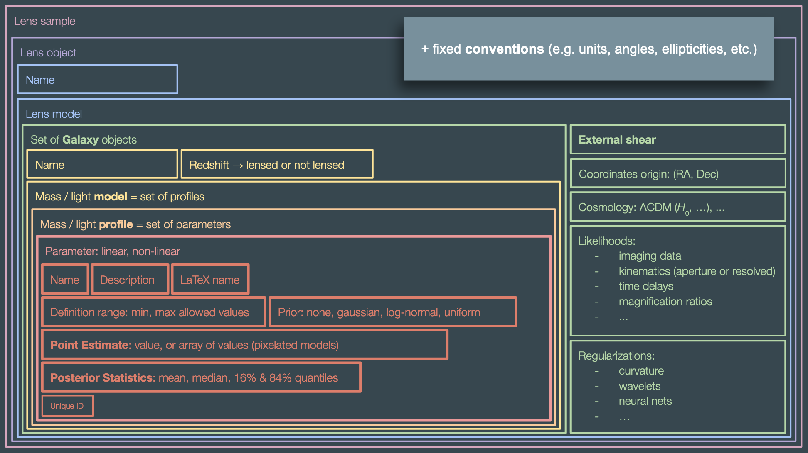

# LensModelAPI: a standard for lens models

API for defining application-independent lens models, aiming to __generate template files__ to initalize models, and __store output results__ from _any_ lens modeling code/pipeline.

The first implementation takes the form of collection of Python classes, organised in a very general hierarchy common to most of lens model software packages. It can the be encoded as JSON or YAML human-readable files that serve as templates for initialiazing and storing modeling results.

Current hierarchy:

