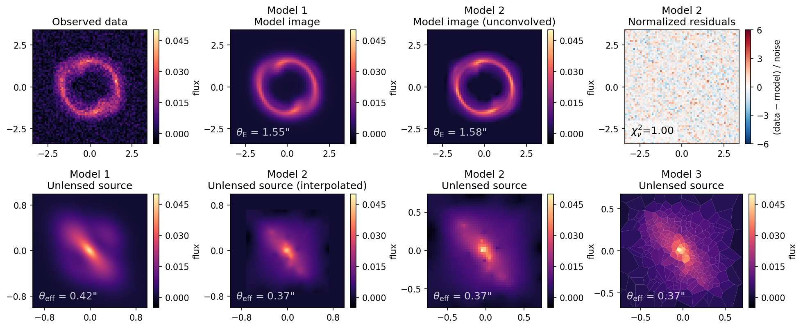

# Standard for Strong Gravitational Lensing Analyses


[](https://github.com/aymgal/COOLEST/actions/workflows/ci-tests.yml)
[](https://coveralls.io/github/aymgal/COOLEST)
[](https://coolest.readthedocs.io/en/latest/?badge=latest)

[](https://doi.org/10.21105/joss.05567)

## What is COOLEST?

The COde-independent Organized LEns STandard (COOLEST) defines a set of conventions to be shared across the strong lensing community, in order to consistently store, share and improve lens modeling analyses. In short, this project provides tools to manipulate lens models as a single, human-readable JSON template file alongside Python routines for visualizing and comparing lens models possibly obtained from different modeling codes.

For more information and the full list of COOLEST features, refer to the [online documentation](https://coolest.readthedocs.io/en/latest/).

## Components of the standard

COOLEST is composed of three distinct building blocks:

- __A set of [conventions](docs/conventions.md)__: reference point for all modelling assumptions and codes, which includes coordinate systems, units and profile definitions used when manipulating the lens models stored in the template file;

- __Template file system__ ([`coolest.template`](coolest/template/)): a Python interface to create, store and manipulate COOLEST template files (JSON format) and linked external files (such as FITS files for data and pixelated model components);

- __Analysis & plotting__ ([`coolest.api`](coolest/api/)): a Python interface to compute key lensing quantities and generate publication-ready lens model plots.

## Examples

See the [`example notebooks`](docs/notebooks) directory to generate and manipulate typical JSON template files describing lens models. Below is an example of plot generated using the `coolest.api` submodule.



## Installation of the Python package

### Latest released version

The easiest way to install the latest version of the `coolest` Python package is via PyPi:
```bash
# Activate your virtual environment before if needed

pip install coolest
```

### Latest development version

You can also install it from the GitHub repository directly to get access to the latest changes: 
```bash
# Clone the latest version
git clone https://github.com/aymgal/COOLEST.git

# Move to the repo directly
cd COOLEST

# Now is a good idea to activate your virtual environment if needed
```

Then you can install the `coolest` package. If you wish to modify or contribute to the source code, do not forget to use the `-e` option in the commands below to install it in development mode. For installing the package without optional dependencies, use the following command:
```bash
# install coolest and required dependencies
pip install [-e] .
```
For installing the package with all optional dependencies, use the following command:
```bash
# also install optional dependencies
pip install [-e] ".[opt]"
```

You can test the installation by running `python -c "import coolest"` in the terminal, or by running some of the example notebooks from the [documentation](docs/notebooks) directory. Moreover, you can run all unit tests (having `pytest` installed in your environment), with the command `pytest test`.

## Contributing to the COOLEST standard

We encourage and highly value All types of feedback, feature proposals and contributions from the whole lensing community. Please have a look at [CONTRIBUTING.md](CONTRIBUTING.md) for more information about contributing to the project.

## Citing the COOLEST standard

If you make use of COOLEST for your research, please cite our [JOSS publication](https://joss.theoj.org/papers/10.21105/joss.05567). Here is the corresponding BibTeX entry:

```
@article{Galan2023,
    author = {Galan, Aymeric and de Vyvere, Lyne Van and Gomer, Matthew R. and Vernardos, Georgios and Sluse, Dominique},
    doi = {10.21105/joss.05567},
    journal = {Journal of Open Source Software},
    month = aug,
    number = {88},
    pages = {5567},
    title = {{COOLEST: COde-independent Organized LEns STandard}},
    url = {https://joss.theoj.org/papers/10.21105/joss.05567},
    volume = {8},
    year = {2023}
}
```

## Original contributors

The full list of contributors is given in [AUTHORS.md](AUTHORS.md).

As this is an open source project, we very much appreciate any feedback and new contributions from the community. The goal is really to improve the standard so that most of the research using strong lens modeling can benefit from it.
