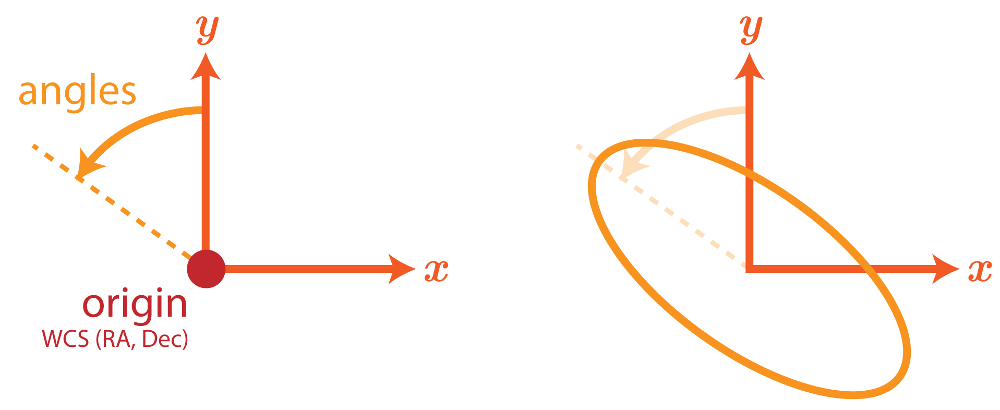

# COOLEST conventions

The standard relies on a set of fixed conventions, that are implicitly assumed by all lens models stored in the COOLEST format.

## Units

- Width, height, angular positions and length (e.g. radii) are all given in **arcseconds**.
- Position angles and orientations are given in **degrees**, by default in the interval $(-90^\circ, +90^\circ]$. This typically holds true for profiles with 180° symmetry such as elliptical profiles and external shear. Otherwise, it is explicitly mentioned in the profile definition.
- data and model images (e.g., including pixelated light profiles) are assumed to be given in **electrons per second**. If these units are evidently not suitable to the type of data (e.g., radio wavelenghts), the alternative units must be specified in the `'meta'` section of the template.

## Coordinates system

- The origin of the coordinate system in which all quantities are defined is fixed by a **single absolute J2000 coordinate**, given in `0h:0m:0.0s` (right ascension) and `0d:0m:0.0s` (declination) format. Any dependence on a specific field-of-view should be subtracted out.
- Quantities are expressed in a **cartesian coordinate system** $(x, y)$, the $x$ axis positively increasing to the right, the $y$ axis positively increasing upwards. Since coordinates are then always aligned with the image axes, this is a more intuitive description compared to (RA, Dec).
- Position angles and orientations (usually denoted $\phi$) are measured counter-clockwise from the positive $y$ axis. Thus it is similar to the frequently used "East-of-North" convention.

    

## Notations

- Cartesian coordinates are given $(x,y)$, polar coordinates are $(r,\phi)$. If required, the radial vector (in polar coordinates) is $\boldsymbol{r}$.
- Parameters and quantities representing radii are given in angular units (i.e. arcsec) and thus it is better suited to note them "$\theta$" (instead of "$r$"). This includes the Einstein radius ($\theta_{\rm E}$) and the effective radius ($\theta_{\rm eff}$), for instance. However, fpr some profiles are systematically defined with "$r$" in the literature (e.g., NFW), the common notations are followed.
- Notations for recurrent lensing quantities:
    - $\psi$: lens potential;
    - $\boldsymbol{\alpha}$: deflection field;
    - $\kappa$: surface mass density or convergence;
    - $\boldsymbol{\gamma}$: shear field;
    - $\mu$: magnification.

## Ellipticity parametrization

For elliptical profiles, any characteristic radius (e.g., Einstein radius, half-light radius) is given along the **intermediate axis**, as the product average of the semi-major and semi-minor axis, i.e. $r_{\rm inter} = \sqrt{a\,b}$. The relation between intermediate-axis and major-axis is $r_{\rm inter} = \sqrt{q}\, a$, where $q = b/a$ is the axis ratio of the ellipse.
